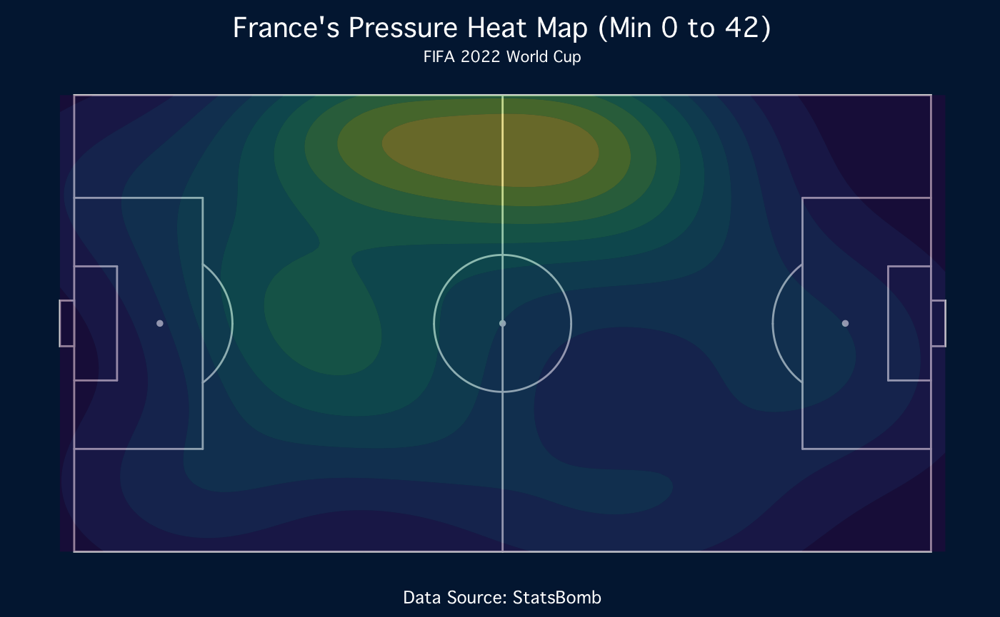
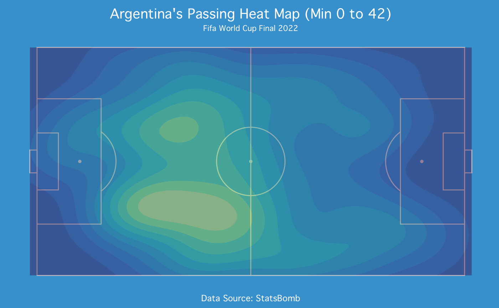
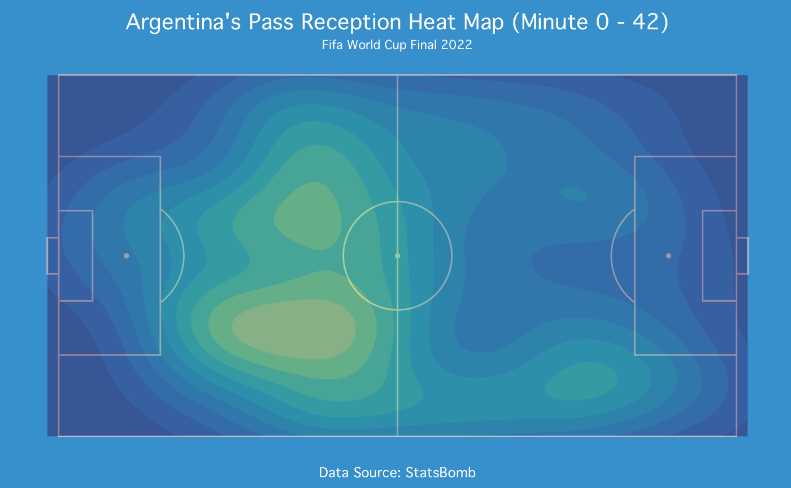
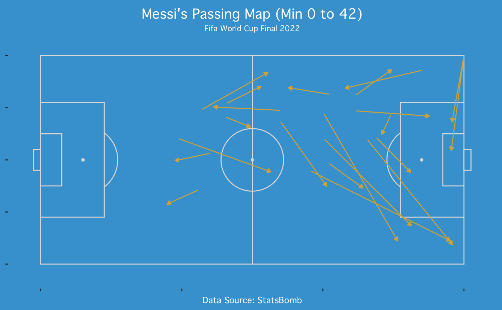
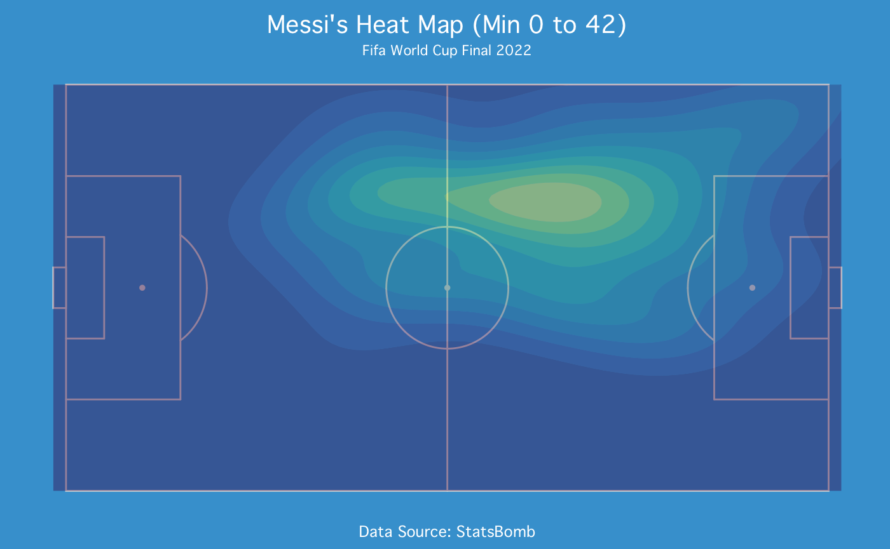
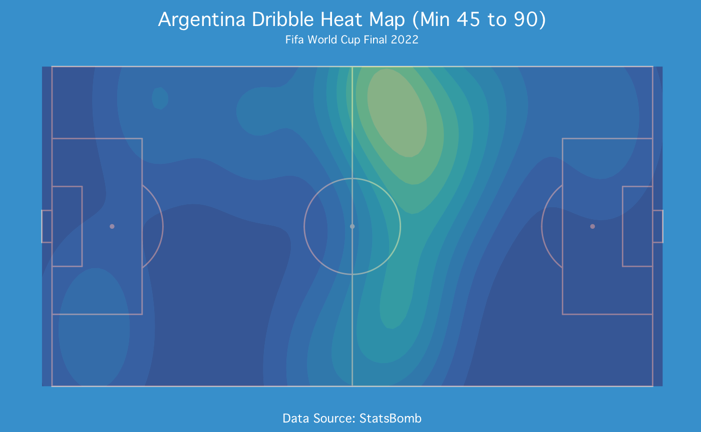
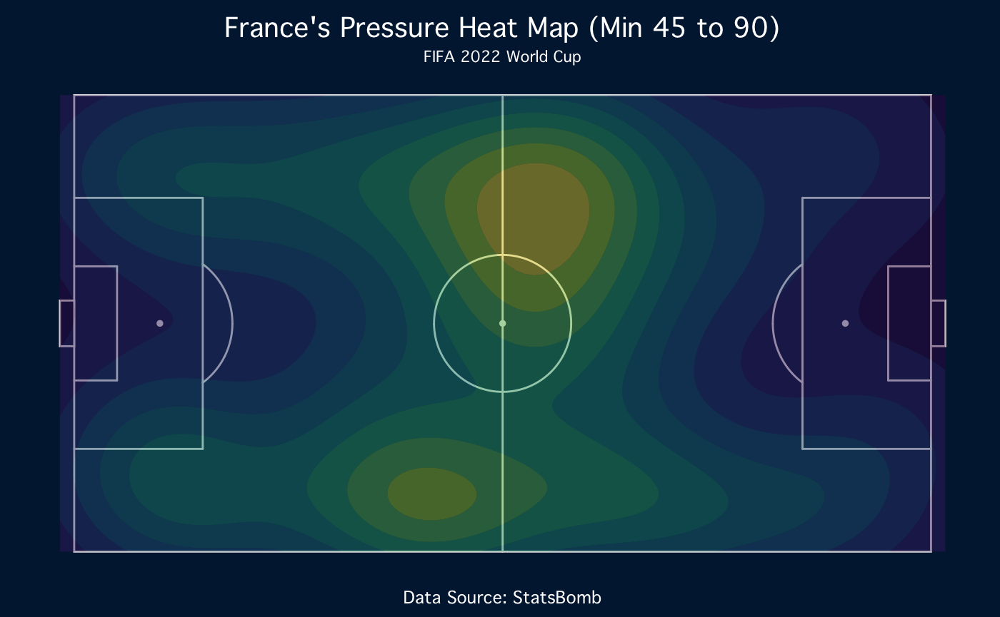

# 2022 WC Finals

The final match in the 2022 World Cup between France and Argentina has
been crowned as “Best game of our lifetime” by many fans, players and
pundits. The defending champions France looked to bring the Trophy back
to their home country, as Argentina tried to end their 40 year drought
for a World cup title.

The build-up ahead of this game was mostly about Messi vs Mbappe. Messi
needed the missing piece in his trophy cabinet to solidify himself as
the “Greatest of all time”, while Mbappe needed his second World Cup
Trophy to get his name into the “Greatest of all time” conversation.

We use R and its visualization tools to analyse this game, we will try
to analyse patterns and tactics behind this goal-fiesta of a match.

The data for this analysis was provided by Statbomb and its [free to use
datasets.](https://github.com/statsbomb/open-data)

# Line up

    ##    jersey_number                     player.name             position.name
    ##               23        Damián Emiliano Martínez                Goalkeeper
    ##               26            Nahuel Molina Lucero                Right Back
    ##               13         Cristian Gabriel Romero         Right Center Back
    ##               19         Nicolás Hernán Otamendi          Left Center Back
    ##                3    Nicolás Alejandro Tagliafico                 Left Back
    ##               24                  Enzo Fernandez Center Defensive Midfield
    ##               7          Rodrigo Javier De Paul     Right Center Midfield
    ##               20             Alexis Mac Allister      Left Center Midfield
    ##               10  Lionel Andrés Messi Cuccittini                Right Wing
    ##               11 Ángel Fabián Di María Hernández                 Left Wing
    ##                9                  Julián Álvarez            Center Forward

    ##    jersey_number                     player.name             position.name
    ##                1                     Hugo Lloris                Goalkeeper
    ##                5                    Jules Koundé                Right Back
    ##                4                  Raphaël Varane         Right Center Back
    ##               18        Dayotchanculle Upamecano          Left Center Back
    ##               22 Theo Bernard François Hernández                 Left Back
    ##                8       Aurélien Djani Tchouaméni  Right Defensive Midfield
    ##               14                   Adrien Rabiot   Left Defensive Midfield
    ##               11                 Ousmane Dembélé                Right Wing
    ##                7               Antoine Griezmann Center Attacking Midfield
    ##               10            Kylian Mbappé Lottin                 Left Wing
    ##                9                  Olivier Giroud            Center Forward

Both team lined up in their most used formations, 4-3-3 for Argentina
and 4-2-3-1 for France.

# 0 - 41

Argentina had a visible dominance over France in the first half, let
take a deeper look of what went down in that first half. The french
manager Didier Deschamps made a decision to substitute their main
striker Oliver Giroud and right winger Ousmanne Dembele at minute 41.
The substitution changed the game for France in the second half, so lets
begin by look at how the match panned out between minute 0 and 42.

    ##   A tibble: 26 × 4
    ##    type.name      Argentina France Total
    ##    <chr>              <int>  <int> <int>
    ##    Pass                 277    153   430
    ##    Ball Receipt*        265    132   397
    ##    Carry                216    105   321
    ##    Pressure              35     51    86
    ##    Duel                  15     14    29
    ##    Ball Recovery         14      8    22
    ##    Foul Committed         8     10    18
    ##    Foul Won              10      7    17
    ##    Dribble               11      4    15
    ##   Interception           5      7    12
    ## # … with 16 more rows

The dataframe shows us Argentina had a higher ball possession
(possession is define as completed passes by FIFA), this despite the
higher pressure attempt by France. So why wasnt the pressure working (or
maybe it did?). Lets try to dive deeper to the pressure attempts.

It doesnt look like there is a correlation between Frances pressure and
Argentinas passers, what if Deschamps tactics was not to pressure to
passer but rather pressure the receiver?

So the heat maps shows no correlation between pressure on
passer/receiver, but then what was the reason France kept applying
pressure on Argentina’s left side for the majority of the first half?
 

Lets take a look on the dribbles for the Argentina players

    ## # A tibble: 12 × 3
    ## # Groups:   player.name [12]
    ##    player.name                     Dribble `Dribbled Past`
    ##    <chr>                             <int>           <int>
    ##  1 Ángel Fabián Di María Hernández       7               0
    ##  2 Rodrigo Javier De Paul                2               0
    ##  3 Alexis Mac Allister                   1               0
    ##  4 Lionel Andrés Messi Cuccittini        1               0
    ##  5 Cristian Gabriel Romero               0               1
    ##  6 Damián Emiliano Martínez              0               0
    ##  7 Enzo Fernandez                        0               1
    ##  8 Julián Álvarez                        0               0
    ##  9 Nahuel Molina Lucero                  0               0
    ## 10 Nicolás Alejandro Tagliafico          0               0
    ## 11 Nicolás Hernán Otamendi               0               0

The dataframe shows that Angel Di Maria that the highest attempt of
Dribbles among the Argentina squad. The Argentinian manager Lionel
Scaloni’s selection of Di Maria, whho hadn’t received any significant
playing time since the last game of the group stages, seem to be purely
tactical. The idea is to let Di Maria attack France’s right flank and
expose the defensively weak right winger Ousmanne Dembele and thus
opening up the field for Argentina. This tactical decision seem to payed
off when Di Maria tricky dribbling on the left side won Argetina a
penalty which Leo Messi managed to convert.  

By forcing France to apply pressure on their right side to give
defensive support for Ousmanne Dembele, Argentina seemed to be playing
as far away from Kylian Mbappe on the opposite side of the field as
possible, and isolating him from the action.

## Messi

How did Messi fit in the grand scheme of things in the first half?

Lets take a look of his passing and heat map

The visualization shows us that despite lining up as “Right Winger”,
most of Messi’s actions and plays came from the left side, the passing
map shows how the pass distance were significantly shorter when passing
to the left side compared to the right side because of this position,
further supporting the theory playing **away** from Kylian Mbappe on the
opposite side.

# Second half

French manager subbed in Marcus Thuram and Randal Kolo Muani at the end
of first to try to turn things around. Thuram, a more defensive
midfielder than Dembele, was clearly brought in to stop the left flank
of Argentina and perhaps make Argentina play more towards the middle or
the right side.

    ## # A tibble: 13 × 3
    ## # Groups:   player.name [13]
    ##    player.name                     Dribble `Dribbled Past`
    ##    <chr>                             <int>           <int>
    ##  1 Rodrigo Javier De Paul                2               2
    ##  2 Alexis Mac Allister                   1               1
    ##  3 Lionel Andrés Messi Cuccittini        1               0
    ##  4 Ángel Fabián Di María Hernández       1               2
    ##  5 Cristian Gabriel Romero               0               0
    ##  6 Damián Emiliano Martínez              0               0
    ##  7 Enzo Fernandez                        0               0
    ##  8 Julián Álvarez                        0               2
    ##  9 Marcos Javier Acuña                   0               0
    ## 10 Nahuel Molina Lucero                  0               1
    ## 11 Nicolás Alejandro Tagliafico          0               0
    ## 12 Nicolás Hernán Otamendi               0               0
    ## 13 <NA>                                  0               0

The tactical change by Deschamp seem to be giving effect as France
pressured more on the right side and the number of dribbles decreased
from the first half.

## Kylian Mbappe

The ball dominating Argentina was nowhere to be found in the second
half.

    ## # A tibble: 2 × 5
    ## # Groups:   team.name [2]
    ##   team.name  Pass Dribble Dispossessed `Foul Committed`
    ##   <chr>     <int>   <int>        <int>            <int>
    ## 1 Argentina   224       5            7               10
    ## 2 France      286      12            4                7

France had more control of the ball and was being more agressive on the
offensive end, they kept attacking Argentina and won more fouls in the
second half.
